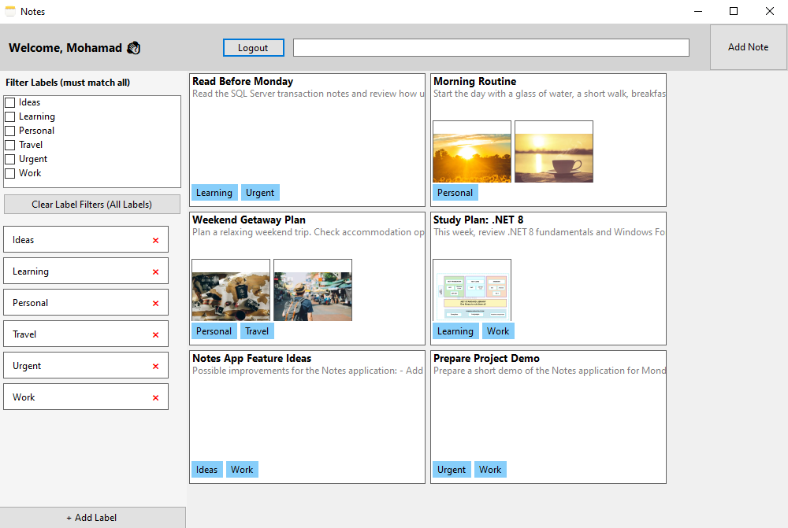
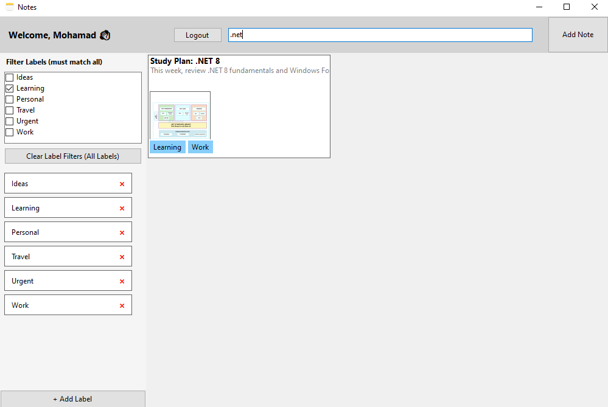
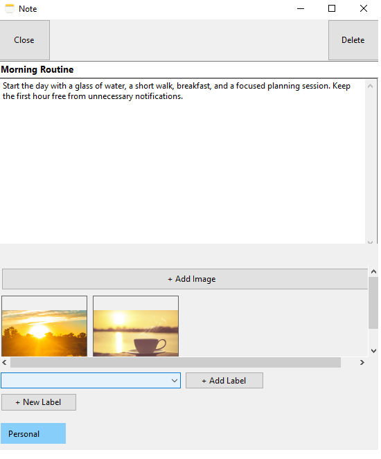
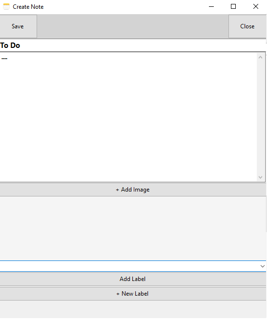

# Notes

A lightweight desktop note-taking application built with **C#**, **.NET 8**, **Windows Forms**, and **SQL Server**.

Notes provides a simple workspace for creating, organizing, searching, and managing personal notes with labels and image attachments.

## Features

- User registration and sign-in
- Persistent login using a locally stored user ID
- Create notes with a title, content, labels, and image attachments
- Auto-save note title and content changes
- Multiple labels and images per note
- Duplicate label prevention
- Search notes by title and content
- Filter notes by one or more labels
- AND-based multi-label filtering
- Label management from the sidebar
- Delete notes with related image records and label relationships
- Local image storage using relative paths

## Screenshots

| Main Dashboard | Search and Label Filtering |
|:---:|:---:|
|  |  |

| Note Details and Labels | Create Note |
|:---:|:---:|
|  | |

## Technology Stack

| Technology | Purpose |
|---|---|
| C# | Application development |
| .NET 8 | Target framework |
| Windows Forms | Desktop user interface |
| SQL Server | Data persistence |
| Microsoft.Data.SqlClient | SQL Server connectivity |
| ADO.NET | Database access |
| System.Text.Json | Local login data serialization |

## Project Structure

```text
Notes
│
├── DataAccess
│   ├── DatabaseManager.cs
│   ├── NoteRepository.cs
│   ├── LabelRepository.cs
│   └── UserRepository.cs
│
├── Forms
│   ├── MainForm.cs
│   ├── CreateNoteForm.cs
│   ├── NoteDetailForm.cs
│   ├── SigninForm.cs
│   └── SignupForm.cs
│
├── Models
│   ├── Note.cs
│   ├── NoteInfo.cs
│   ├── NoteLabel.cs
│   ├── NoteImage.cs
│   ├── User.cs
│   ├── UserLabel.cs
│   └── LabelModel.cs
│
├── Session
│   └── UserSession.cs
│
├── Utilities
│   ├── ImageStorageHelper.cs
│   ├── LoginStorage.cs
│   └── PasswordHelper.cs
│
└── UserControls
    └── NoteCardControl.cs
```

## Authentication and Persistent Login

Passwords are hashed before being stored in the database; plain-text passwords are not persisted.

After a successful sign-in, the application stores only the current user's `UserId` locally:

```text
%AppData%\Notes\login.json
```

No password or password hash is stored in this file. The saved login is removed when the user logs out.

## Notes and Labels

A note can include a title, content, one or more labels, and multiple image attachments.

- Notes can be searched by title and content.
- Labels are trimmed and compared case-insensitively to prevent duplicates.
- A note can have multiple labels, and a label can be associated with multiple notes.
- Removing a label does not delete the user's notes.

## Search and Label Filtering

Notes can be filtered by search text and selected labels at the same time.

When multiple labels are selected, **AND logic** is applied. A note is displayed only when it contains every selected label.

Example:

```text
Search text: meeting
Selected labels: Work + Urgent
```

The result contains only notes that include `meeting` in their title or content and have both the `Work` and `Urgent` labels.

When no labels are selected, notes from all labels are included.

## Auto-Save in NoteDetailForm

When a user opens an existing note in `NoteDetailForm` to view or edit it, changes to the note title and content are saved automatically.

After the user stops typing, the application waits briefly before saving to avoid unnecessary database updates for every keystroke. Any unsaved title or content changes are also saved when the `NoteDetailForm` is closed.

## Image Storage

Images are stored locally under:

```text
%AppData%\Notes\Images
```

Each note has a dedicated folder based on its ID. Only relative image paths are stored in the database:

```text
Images\[NoteId]\[ImageFileName].jpg
```

Images selected during note creation remain temporary until the note is saved. After saving, they are copied to the local Notes image directory.

## Database

Database name:

```text
Notes
```

Required tables:

```text
Users
Notes
Labels
UserLabels
NoteLabels
NoteImages
```


## Requirements

- .NET 8 SDK
- Visual Studio 2022 or later
- SQL Server
- `Microsoft.Data.SqlClient` NuGet package

## Configuration

Configure the SQL Server connection string in `DatabaseManager.cs`.

```csharp
private const string ConnectionString =
    "Server=.;Database=Notes;Trusted_Connection=True;TrustServerCertificate=True;";
```

## Running the Application

1. Open the solution in Visual Studio.
2. Create the `Notes` database and required tables in SQL Server.
3. Configure the connection string in `DatabaseManager.cs`.
4. Restore NuGet packages and build the project.
5. Run the application.
6. Create an account or sign in to start managing notes.

